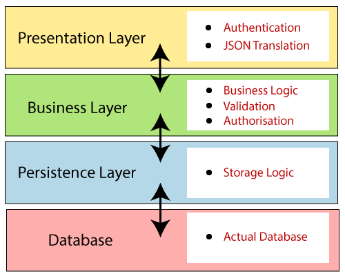
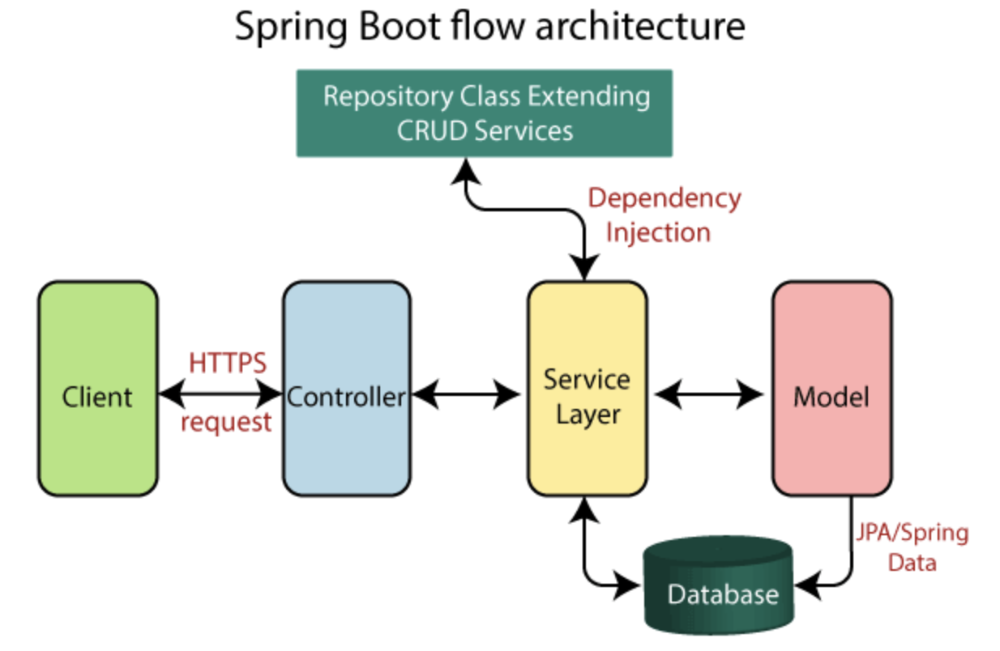
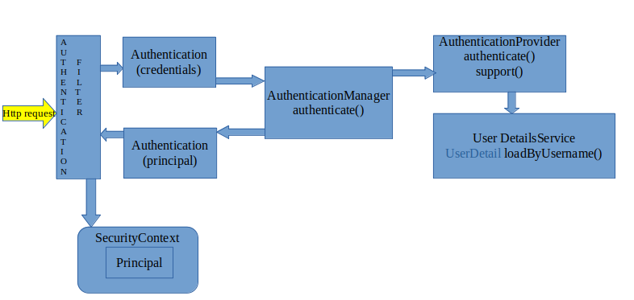
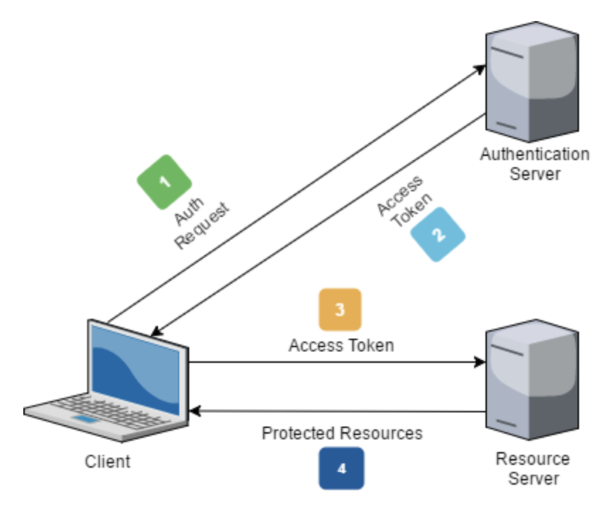

# Architecture

## Data Model

I preferred to design a DB model which enable all the functionality with the maximum of data flexibility, even if I have not leveraged sophisticated SQL and RDBMS features as relational integrity enforcement.

All the application tables (which means all except the ApplicationUser one used for security) have a unique id and primary key named <i><b>id</b></i> and defined as a <i><b>long</b></i>.
Such attributes are used to create the relations between the tables.

An <i><b>N-M</b></i> relation between the entities <i><b>Recipe</b></i> and <i><b>Ingredient</b></i> is implemented by the correlation entity <i><b>RecipeIngredientRelation</b></i>.

### Entity-Relationship model

The data model could have been designed in a simpler way, for example inserting the ingredients as a comma separated list within a CLOB attribute in the Recipe entity, but this would have been a very rude and not flexible solution.

The instructions of a recipe are stored as a text (in this implementation a VarChar).

### Data protection

The data in the inmemory database are not protected from a "privacy" perspective, as this security issue is seen as out of scope for this short term project.

For the same reason the ApplicationUser table, which is used for the authentication of the users, is only intended as a mockup of a corporate IAM solution.

## Layering

The Recipes application (as most of Spring Boot applications) has four layers:

+ Presentation Layer – Authentication & Json Translation
+ Business Layer – Business Logic, Validation & Authorization
+ Persistence Layer – Storage Logic
+ Database Layer – Actual Database (H2)

## Flow Architecture

The Client makes an HTTP request(GET, PUT, POST, etc.)

The Spring Boot framework check for the authenticity of the user request, validating the permissions and in case asking for a login.

The HTTP request is forwarded to the Controller. 
The controller maps the request. 
It processes the handles and calls the server logic.

The business logic is performed in the Service layer. 
The spring boot performs all the logic over the data of the database which is mapped to the spring boot model class through Java Persistence Library(JPA) and stored in the in memory H2 database.

The JSON content is returned as Response from the controller.

## Security: Spring Boot and JWT

The security of the application is realised via the standard Spring Security Architecture.

The RecipesApplciation uses a JWT standard authentication structure for the dialog flow with the clients.

The authentication Server is implemented inside the RecipesApplication but could be externalised to a standard company service.

### Reference

[Understand Spring Security Architecture](https://www.javainuse.com/webseries/spring-security-jwt/chap3)

## Query-by-example feature

The implementation of the Query-by-example needed for the search functionality, is very rude, but working.

It's all contained in the <b>retrieveRecipes</b> function within the <b>RecipeService</b> class, where a set of flags are evaluated based on the presence of input parameters.
It's a complex implementation and algorithm, which could be improved and mostly reengineered to make it more flexible and maintainable, but limit of time prevented such optimization.

With a different DB structure it could be easily been delegated to the DAO layer,
or a more complex query schema could be used always via the DAO components,
but for project simplicity and time constrains I preferred to go brute force
with code, which could be even not performance effective.

