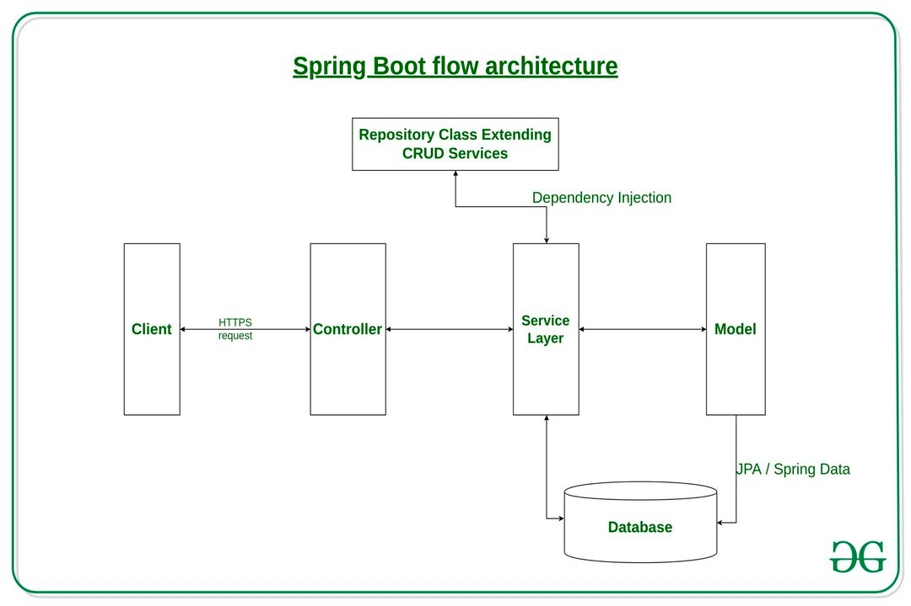

# Architecture

## Layering

The Recipes application has four layers:

+ Presentation Layer – Authentication & Json Translation
+ Business Layer – Business Logic, Validation & Authorization
+ Persistence Layer – Storage Logic
+ Database Layer – Actual Database (H2)

## Flow Architecture

The Client makes an HTTP request(GET, PUT, POST, etc.)

The Spring Boot framework check for the authenticity of the user request, validating the permissions and in case asking for a login.

The HTTP request is forwarded to the Controller. 
The controller maps the request. 
It processes the handles and calls the server logic.

The business logic is performed in the Service layer. 
The spring boot performs all the logic over the data of the database which is mapped to the spring boot model class through Java Persistence Library(JPA) and stored in the in memory H2 database.

The JSON content is returned as Response from the controller.

## Security

## Data Model

The data model could have been designed in a simpler way, for example inserting the ingredients as a comma separated list within a CLOB attribute in the Recipe entity, but this would have been a very rude and not flexible solution.
The instructions of a recipe are stored as a text (in this implementation a VarChar).

