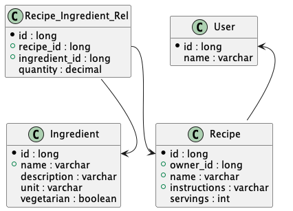

# Implementation and Test

## General consideration

The RecipesApplication provides 2 sets of different RESTful APIs:

- final user oriented APIs as indicated by the requirement
- full CRUD APIs for an admin a monitoring activity on the system

The first set is the real output of the project, 
while the second enable the test and check of the system from a developer perspective 
and are not intended  for an end user access.
Because of usability in the development the CRUD APIs have not been secured, 
but could and should be locked if not completely removed in a production environment.

## Authorized users
This is a list of authorized users:

|Username|Password|Note|
|---|---|---|
|paolo|brunasti|main user, has 3 recipes|
|mario|bross|alternative user with just 1 recipe|

## Data Model

### Entity-Relationship model

### Entities

#### Recipe

The recipe, uniquely identified by a name and an owner.

There can be different recipes with the same name but belonging to different users. 

#### Ingredient

An ingredient that can be used in multiple recipes.
It must have an unique name, and could be used by multiple users.

#### RecipeIngredientRelation
This entity implement the relation between the Recipe and the Ingredient, so to allow a N-M cardinality, and storing the quantity of a particular ingredient in the specific recipe.

#### ApplicationUser

This ApplicationUser entity is intended as a placeholder for the corporate IAM system.

The password is not encrypted  just because of not enough time to cover all the security aspects of a full IAM system.

## Packaging

### it.brunasti.abnamro.recipes

### it.brunasti.abnamro.recipes.controllers

Controller classes which define the RESTful API Endpoints and match the business logic calls.

#### CRUD
For simplicity the CRUD endpoints for the database tables include even the business logic.

#### ApplicationController
The main controller is <b>ApplicationController</b>, which implements the required RESTful APIs endpoints 
and forwards the requests to the RecipesService.

### it.brunasti.abnamro.recipes.db

JPA and DAO classes mapping the database tables.

For each table there are two classes:
- [table].class : JPA entity
- [table]Repository.class : JpaRepository extension which defines the extra query functions 

### it.brunasti.abnamro.recipes.exceptions

Application Exceptions classes.

### it.brunasti.abnamro.recipes.jwt

Security classes for both authentication and JWT functions.

### it.brunasti.abnamro.recipes.requests

RESTful API request resources.

### it.brunasti.abnamro.recipes.responses

RESTful API response resources.

### it.brunasti.abnamro.recipes.services

Business logic classes, which coordinate the creation and retrieve logic with the underlaying persistence classes. 

## Query-by-example feature

The implementation of the Query-by-example needed for the search functionality, is very rude, but working.

It's all contained in the <b>retrieveRecipes</b> function within the <b>RecipeService</b> class, where a set of flags are evaluated based on the presence of input parameters.
It's a complex implementation and algorithm, which could be improved and mostly reengineered to make it more flexible and maintainable, but limit of time prevented such optimization.

With a different DB structure it could be easily been delegated to the DAO layer,
or a more complex query schema could be used always via the DAO components,
but for project simplicity and time constrains I preferred to go brute force
with code, which could be even not performance effective.

## Testing with Postman

Postman can be used to test the RecipesApplication APIs.

A Collection of  predefined requests for Postman are provided in the attached repository file:

[Postmen collection](./ABN-AMRO.postman_collection.json)

To execute the test in Postman you first have to create a Token:

0. start the RecipesApplication 
1. in a browser open the URL: http://localhost:8080/
2. execute the login with the parameters: 
- username: paolo
- password: brunasti
3. Press the "Get Access Token" button
4. Copy the highlighted string of the Access Token which is shown just below between '[' and ']', but without the square brackets and the spaces.
5. Go to Postman
6. In one of the requests in the ABN-AMRO collection open the "Authorization" tab
7. Select as "Type" : "Bearer Token"
8. On the right side of the "Authorization" panel, in the "Token" field, paste the value you copied from the browser page
9. "Send" the request

If required or desired, there is a second user:
- username: mario
- password: bross

This user can be used to try accessing the recipes of the other user "paolo"

## Possible improvements

### Use of SessionAttribute for the JWT

