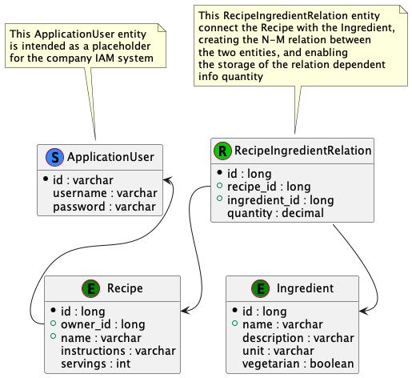

#Implementation

## Data Model

### Entity-Relationship model

### Entities

#### Recipe

#### Ingredient

#### RecipeIngredientRelation
This entity implement the relation between the Recipe and the Ingredient, so to allow a N-M cardinality, and storing the quantity of a particular ingredient in the specific recipe.

#### ApplicationUser

This ApplicationUser entity is intended as a placeholder for the corporate IAM system.

The password is not encrypted  just because of not enough time to cover all the security aspects of a full IAM system.

## Packaging

### it.brunasti.abnamro.recipes
### it.brunasti.abnamro.recipes.db
### it.brunasti.abnamro.recipes.exceptions
### it.brunasti.abnamro.recipes.jwt
### it.brunasti.abnamro.recipes.requests
### it.brunasti.abnamro.recipes.responses
### it.brunasti.abnamro.recipes.services

## Query-by-example feature

The implementation of the Query-by-example needed for the search functionality, is very rude, but working.

It's all contained in the <b>retrieveRecipes</b> function within the <b>RecipeService</b> class, where a set of flags are evaluated based on the presence of input parameters.
It's a complex implementation and algorithm, which could be improved and mostly reengineered to make it more flexible and maintainable, but limit of time prevented such optimization.

With a different DB structure it could be easily been delegated to the DAO layer,
or a more complex query schema could be used always via the DAO components,
but for project simplicity and time constrains I preferred to go brute force
with code, which could be even not performance effective.

